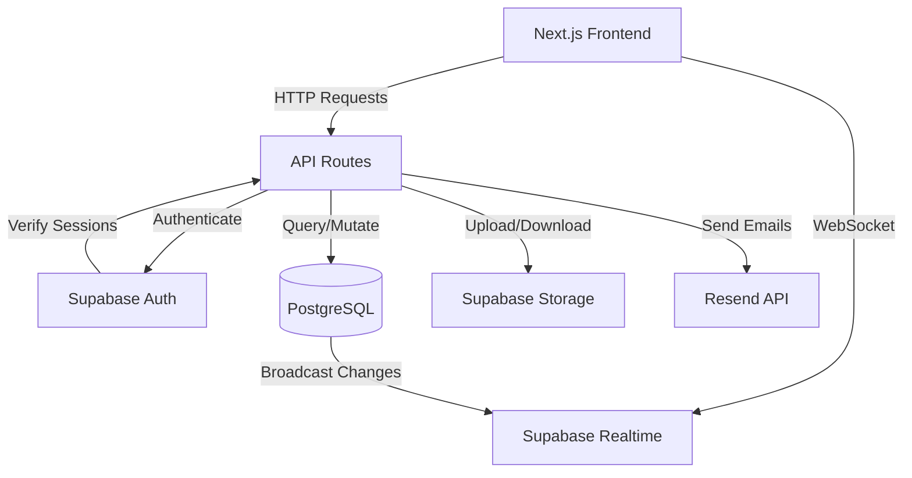
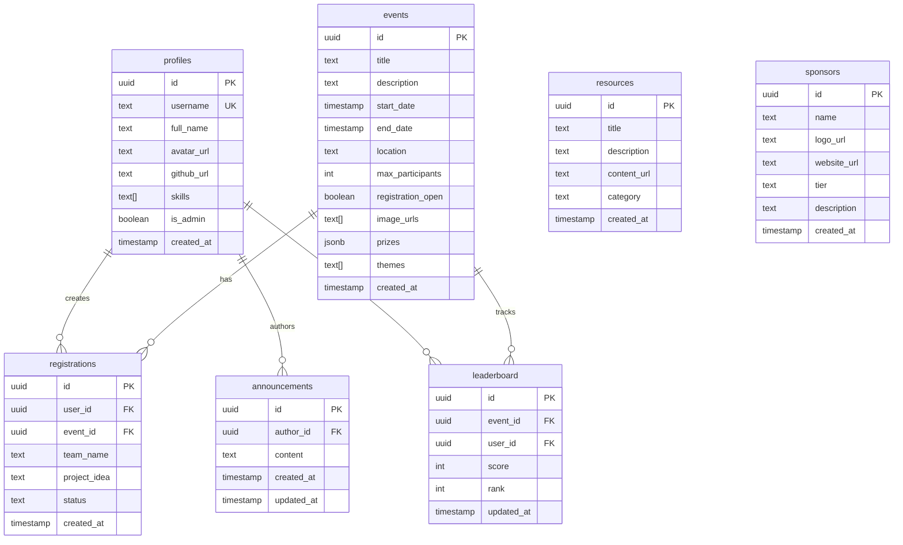

# Design Document: TechAssassin Backend

## Overview

The TechAssassin backend is a serverless Next.js 14 application that provides a comprehensive API for a hackathon community platform. The architecture leverages Supabase as the primary backend service, providing PostgreSQL database, authentication, real-time subscriptions, and file storage. The system is designed to run on Vercel's free tier with API routes handling all backend logic.

The design follows a layered architecture:
- **API Layer**: Next.js 14 App Router API routes handling HTTP requests
- **Service Layer**: Business logic and data access functions
- **Data Layer**: Supabase PostgreSQL with Row Level Security
- **Auth Layer**: Supabase Auth for authentication and session management
- **Storage Layer**: Supabase Storage for file uploads
- **Email Layer**: Resend API for transactional emails
- **Real-time Layer**: Supabase real-time subscriptions for live updates

## Architecture

### System Components



### Technology Stack

- **Runtime**: Next.js 14 App Router (Node.js serverless functions)
- **Language**: TypeScript for type safety
- **Database**: Supabase PostgreSQL with Row Level Security
- **Authentication**: Supabase Auth (email/password, OAuth)
- **Storage**: Supabase Storage (S3-compatible)
- **Real-time**: Supabase Realtime (WebSocket subscriptions)
- **Email**: Resend API for transactional emails
- **Validation**: Zod for runtime type validation
- **Deployment**: Vercel (serverless functions)

### Database Architecture

The database uses PostgreSQL with the following table relationships:



## Components and Interfaces

### 1. Database Schema and Migrations

**Supabase Migration Files**: SQL files to create tables, indexes, and RLS policies.

**Tables**:
- `profiles`: Extended user information
- `events`: Hackathon event details
- `registrations`: User event registrations
- `announcements`: Community announcements
- `resources`: Educational content
- `sponsors`: Sponsor information
- `leaderboard`: Event scoring

**Indexes**:
- `idx_events_start_date` on `events(start_date)`
- `idx_registrations_event_id` on `registrations(event_id)`
- `idx_registrations_user_id` on `registrations(user_id)`
- `idx_announcements_created_at` on `announcements(created_at DESC)`
- `idx_leaderboard_event_rank` on `leaderboard(event_id, rank)`

**Constraints**:
- `profiles.username` UNIQUE
- `registrations(user_id, event_id)` UNIQUE
- `registrations.status` CHECK IN ('pending', 'confirmed', 'waitlisted')
- `sponsors.tier` CHECK IN ('gold', 'silver', 'bronze')

### 2. Authentication Module

**Supabase Client Configuration**:
```typescript
// lib/supabase/client.ts
import { createClientComponentClient } from '@supabase/auth-helpers-nextjs'

export const supabase = createClientComponentClient()
```

**Server-side Supabase Client**:
```typescript
// lib/supabase/server.ts
import { createServerComponentClient } from '@supabase/auth-helpers-nextjs'
import { cookies } from 'next/headers'

export const createServerClient = () => {
  return createServerComponentClient({ cookies })
}
```

**Auth Functions**:
- `signUp(email, password)`: Create new user account
- `signIn(email, password)`: Authenticate user
- `signInWithOAuth(provider)`: OAuth authentication
- `signOut()`: End user session
- `resetPassword(email)`: Send password reset email
- `updatePassword(newPassword)`: Update user password
- `getSession()`: Retrieve current session
- `getUser()`: Get authenticated user details

**Profile Creation Trigger**:
A PostgreSQL trigger automatically creates a profile record when a new user signs up via Supabase Auth.

```sql
CREATE TRIGGER on_auth_user_created
  AFTER INSERT ON auth.users
  FOR EACH ROW EXECUTE FUNCTION handle_new_user();
```

### 3. Profile Management Module

**API Routes**:
- `GET /api/profile`: Get current user's profile
- `GET /api/profile/[id]`: Get specific user's public profile
- `PATCH /api/profile`: Update current user's profile
- `POST /api/profile/avatar`: Upload avatar image

**Validation Schemas**:
```typescript
// lib/validations/profile.ts
import { z } from 'zod'

export const profileUpdateSchema = z.object({
  username: z.string().min(3).max(30).regex(/^[a-zA-Z0-9_]+$/),
  full_name: z.string().min(1).max(100),
  github_url: z.string().url().optional(),
  skills: z.array(z.string()).max(10)
})

export const avatarUploadSchema = z.object({
  file: z.instanceof(File)
    .refine(file => file.size <= 2 * 1024 * 1024, 'File must be under 2MB')
    .refine(
      file => ['image/jpeg', 'image/png', 'image/webp'].includes(file.type),
      'File must be an image'
    )
})
```

**Service Functions**:
- `getProfile(userId)`: Fetch profile by ID
- `updateProfile(userId, data)`: Update profile fields
- `uploadAvatar(userId, file)`: Upload and set avatar
- `checkUsernameAvailable(username)`: Verify username uniqueness

### 4. Event Management Module

**API Routes**:
- `GET /api/events`: List events with filters (status: live/upcoming/past)
- `GET /api/events/[id]`: Get event details with participant count
- `POST /api/events`: Create event (admin only)
- `PATCH /api/events/[id]`: Update event (admin only)
- `DELETE /api/events/[id]`: Delete event (admin only)
- `POST /api/events/[id]/images`: Upload event images (admin only)

**Validation Schemas**:
```typescript
// lib/validations/event.ts
import { z } from 'zod'

export const eventCreateSchema = z.object({
  title: z.string().min(1).max(200),
  description: z.string().min(1),
  start_date: z.string().datetime(),
  end_date: z.string().datetime(),
  location: z.string().min(1).max(200),
  max_participants: z.number().int().positive(),
  registration_open: z.boolean().default(true),
  prizes: z.record(z.any()).optional(),
  themes: z.array(z.string()).optional()
}).refine(
  data => new Date(data.end_date) > new Date(data.start_date),
  'End date must be after start date'
)

export const eventUpdateSchema = eventCreateSchema.partial()

export const eventFilterSchema = z.object({
  status: z.enum(['live', 'upcoming', 'past']).optional(),
  page: z.number().int().positive().default(1),
  limit: z.number().int().positive().max(100).default(20)
})
```

**Service Functions**:
- `listEvents(filters)`: Query events with status filtering and pagination
- `getEventById(eventId)`: Fetch single event with participant count
- `createEvent(data)`: Insert new event
- `updateEvent(eventId, data)`: Modify event fields
- `deleteEvent(eventId)`: Remove event and cascade registrations
- `uploadEventImages(eventId, files)`: Store images in Supabase Storage
- `getParticipantCount(eventId)`: Count confirmed registrations
- `calculateEventStatus(event)`: Determine if live/upcoming/past

**Event Status Logic**:
```typescript
function calculateEventStatus(event: Event): 'live' | 'upcoming' | 'past' {
  const now = new Date()
  const start = new Date(event.start_date)
  const end = new Date(event.end_date)
  
  if (now >= start && now <= end) return 'live'
  if (now < start) return 'upcoming'
  return 'past'
}
```

### 5. Registration Module

**API Routes**:
- `POST /api/registrations`: Register for an event
- `GET /api/registrations`: Get current user's registrations
- `GET /api/registrations/event/[eventId]`: Get all registrations for event (admin only)
- `PATCH /api/registrations/[id]`: Update registration status (admin only)

**Validation Schemas**:
```typescript
// lib/validations/registration.ts
import { z } from 'zod'

export const registrationCreateSchema = z.object({
  event_id: z.string().uuid(),
  team_name: z.string().min(1).max(100),
  project_idea: z.string().min(10).max(1000)
})

export const registrationUpdateSchema = z.object({
  status: z.enum(['pending', 'confirmed', 'waitlisted'])
})
```

**Service Functions**:
- `createRegistration(userId, data)`: Create new registration with capacity check
- `getUserRegistrations(userId)`: Fetch user's registrations
- `getEventRegistrations(eventId)`: Fetch all registrations for event
- `updateRegistrationStatus(registrationId, status)`: Change registration status
- `checkDuplicateRegistration(userId, eventId)`: Verify no existing registration
- `determineRegistrationStatus(eventId)`: Return 'confirmed' or 'waitlisted' based on capacity

**Registration Logic**:
```typescript
async function determineRegistrationStatus(eventId: string): Promise<'confirmed' | 'waitlisted'> {
  const event = await getEventById(eventId)
  const confirmedCount = await getConfirmedParticipantCount(eventId)
  
  return confirmedCount < event.max_participants ? 'confirmed' : 'waitlisted'
}
```

**Rate Limiting**:
Implement rate limiting on registration endpoint to prevent abuse:
- 5 registrations per user per hour
- Use in-memory cache or Redis for tracking

### 6. Announcements Module

**API Routes**:
- `GET /api/announcements`: List announcements with pagination
- `POST /api/announcements`: Create announcement (admin only)
- `PATCH /api/announcements/[id]`: Update announcement (admin/author only)
- `DELETE /api/announcements/[id]`: Delete announcement (admin/author only)

**Validation Schemas**:
```typescript
// lib/validations/announcement.ts
import { z } from 'zod'

export const announcementCreateSchema = z.object({
  content: z.string().min(1).max(5000)
})

export const announcementUpdateSchema = announcementCreateSchema

export const announcementListSchema = z.object({
  page: z.number().int().positive().default(1),
  limit: z.number().int().positive().max(50).default(20)
})
```

**Service Functions**:
- `listAnnouncements(pagination)`: Fetch announcements with author info
- `createAnnouncement(authorId, content)`: Insert new announcement
- `updateAnnouncement(announcementId, content)`: Modify announcement
- `deleteAnnouncement(announcementId)`: Remove announcement
- `checkAnnouncementOwnership(announcementId, userId)`: Verify author or admin

### 7. Resources Module

**API Routes**:
- `GET /api/resources`: List resources with optional category filter
- `POST /api/resources`: Create resource (admin only)
- `PATCH /api/resources/[id]`: Update resource (admin only)
- `DELETE /api/resources/[id]`: Delete resource (admin only)

**Validation Schemas**:
```typescript
// lib/validations/resource.ts
import { z } from 'zod'

export const resourceCreateSchema = z.object({
  title: z.string().min(1).max(200),
  description: z.string().min(1).max(1000),
  content_url: z.string().url(),
  category: z.string().min(1).max(50)
})

export const resourceUpdateSchema = resourceCreateSchema.partial()

export const resourceFilterSchema = z.object({
  category: z.string().optional(),
  page: z.number().int().positive().default(1),
  limit: z.number().int().positive().max(50).default(20)
})
```

**Service Functions**:
- `listResources(filters)`: Query resources with filtering and pagination
- `createResource(data)`: Insert new resource
- `updateResource(resourceId, data)`: Modify resource
- `deleteResource(resourceId)`: Remove resource

### 8. Sponsors Module

**API Routes**:
- `GET /api/sponsors`: List all sponsors (public)
- `POST /api/sponsors`: Create sponsor (admin only)
- `PATCH /api/sponsors/[id]`: Update sponsor (admin only)
- `DELETE /api/sponsors/[id]`: Delete sponsor (admin only)
- `POST /api/sponsors/[id]/logo`: Upload sponsor logo (admin only)

**Validation Schemas**:
```typescript
// lib/validations/sponsor.ts
import { z } from 'zod'

export const sponsorCreateSchema = z.object({
  name: z.string().min(1).max(100),
  logo_url: z.string().url(),
  website_url: z.string().url(),
  tier: z.enum(['gold', 'silver', 'bronze']),
  description: z.string().max(500).optional()
})

export const sponsorUpdateSchema = sponsorCreateSchema.partial()
```

**Service Functions**:
- `listSponsors()`: Fetch all sponsors ordered by tier
- `createSponsor(data)`: Insert new sponsor
- `updateSponsor(sponsorId, data)`: Modify sponsor
- `deleteSponsor(sponsorId)`: Remove sponsor
- `uploadSponsorLogo(sponsorId, file)`: Store logo in Supabase Storage

### 9. Leaderboard Module

**API Routes**:
- `GET /api/leaderboard/[eventId]`: Get leaderboard for event
- `POST /api/leaderboard`: Create/update leaderboard entry (admin only)

**Validation Schemas**:
```typescript
// lib/validations/leaderboard.ts
import { z } from 'zod'

export const leaderboardUpdateSchema = z.object({
  event_id: z.string().uuid(),
  user_id: z.string().uuid(),
  score: z.number().int().nonnegative()
})
```

**Service Functions**:
- `getLeaderboard(eventId)`: Fetch leaderboard with participant info
- `upsertLeaderboardEntry(data)`: Create or update score
- `recalculateRanks(eventId)`: Update ranks based on scores

**Rank Calculation**:
```typescript
async function recalculateRanks(eventId: string): Promise<void> {
  // Fetch all entries for event ordered by score DESC
  // Assign ranks (1, 2, 3, ...) handling ties
  // Update rank column for all entries
}
```

### 10. Email Service

**Email Templates**:
- Registration confirmation
- Welcome email for new users
- Password reset (handled by Supabase)

**Resend Integration**:
```typescript
// lib/email/resend.ts
import { Resend } from 'resend'

const resend = new Resend(process.env.RESEND_API_KEY)

export async function sendRegistrationConfirmation(
  to: string,
  eventTitle: string,
  eventDetails: EventDetails
): Promise<void> {
  await resend.emails.send({
    from: 'TechAssassin <noreply@techassassin.com>',
    to,
    subject: `Registration Confirmed: ${eventTitle}`,
    html: renderRegistrationTemplate(eventDetails)
  })
}

export async function sendWelcomeEmail(
  to: string,
  username: string
): Promise<void> {
  await resend.emails.send({
    from: 'TechAssassin <noreply@techassassin.com>',
    to,
    subject: 'Welcome to TechAssassin!',
    html: renderWelcomeTemplate(username)
  })
}
```

**Error Handling**:
Email failures should be logged but not block primary operations. Use try-catch blocks around email sending.

### 11. Real-time Subscriptions

**Supabase Real-time Configuration**:
Enable real-time on tables: `events`, `registrations`, `announcements`, `leaderboard`

**Client-side Subscription Example**:
```typescript
// Client subscribes to registration changes for an event
const channel = supabase
  .channel('event-registrations')
  .on(
    'postgres_changes',
    {
      event: '*',
      schema: 'public',
      table: 'registrations',
      filter: `event_id=eq.${eventId}`
    },
    (payload) => {
      // Update participant count in UI
      updateParticipantCount()
    }
  )
  .subscribe()
```

**Real-time Features**:
- Participant count updates when registrations change
- Announcement feed updates when new announcements posted
- Leaderboard updates when scores change

### 12. Authorization Middleware

**Admin Check Middleware**:
```typescript
// lib/middleware/auth.ts
export async function requireAdmin(userId: string): Promise<boolean> {
  const { data: profile } = await supabase
    .from('profiles')
    .select('is_admin')
    .eq('id', userId)
    .single()
  
  if (!profile?.is_admin) {
    throw new Error('Unauthorized: Admin access required')
  }
  
  return true
}

export async function requireAuth(): Promise<User> {
  const { data: { user } } = await supabase.auth.getUser()
  
  if (!user) {
    throw new Error('Unauthorized: Authentication required')
  }
  
  return user
}
```

**Usage in API Routes**:
```typescript
// app/api/events/route.ts
export async function POST(request: Request) {
  const user = await requireAuth()
  await requireAdmin(user.id)
  
  // Proceed with event creation
}
```

### 13. Row Level Security Policies

**Profiles Table**:
```sql
-- Allow users to read all profiles
CREATE POLICY "Profiles are viewable by everyone"
  ON profiles FOR SELECT
  USING (true);

-- Allow users to update their own profile
CREATE POLICY "Users can update own profile"
  ON profiles FOR UPDATE
  USING (auth.uid() = id);
```

**Events Table**:
```sql
-- Allow everyone to read events
CREATE POLICY "Events are viewable by everyone"
  ON events FOR SELECT
  USING (true);

-- Allow only admins to insert/update/delete events
CREATE POLICY "Only admins can modify events"
  ON events FOR ALL
  USING (
    EXISTS (
      SELECT 1 FROM profiles
      WHERE profiles.id = auth.uid()
      AND profiles.is_admin = true
    )
  );
```

**Registrations Table**:
```sql
-- Allow users to read their own registrations
CREATE POLICY "Users can view own registrations"
  ON registrations FOR SELECT
  USING (auth.uid() = user_id);

-- Allow admins to read all registrations
CREATE POLICY "Admins can view all registrations"
  ON registrations FOR SELECT
  USING (
    EXISTS (
      SELECT 1 FROM profiles
      WHERE profiles.id = auth.uid()
      AND profiles.is_admin = true
    )
  );

-- Allow authenticated users to insert registrations
CREATE POLICY "Users can create registrations"
  ON registrations FOR INSERT
  WITH CHECK (auth.uid() = user_id);

-- Allow admins to update registrations
CREATE POLICY "Admins can update registrations"
  ON registrations FOR UPDATE
  USING (
    EXISTS (
      SELECT 1 FROM profiles
      WHERE profiles.id = auth.uid()
      AND profiles.is_admin = true
    )
  );
```

**Announcements Table**:
```sql
-- Allow authenticated users to read announcements
CREATE POLICY "Authenticated users can view announcements"
  ON announcements FOR SELECT
  USING (auth.uid() IS NOT NULL);

-- Allow admins to create announcements
CREATE POLICY "Admins can create announcements"
  ON announcements FOR INSERT
  WITH CHECK (
    EXISTS (
      SELECT 1 FROM profiles
      WHERE profiles.id = auth.uid()
      AND profiles.is_admin = true
    )
  );

-- Allow authors and admins to update/delete announcements
CREATE POLICY "Authors and admins can modify announcements"
  ON announcements FOR ALL
  USING (
    auth.uid() = author_id OR
    EXISTS (
      SELECT 1 FROM profiles
      WHERE profiles.id = auth.uid()
      AND profiles.is_admin = true
    )
  );
```

**Resources, Sponsors, Leaderboard Tables**:
Similar patterns - public read access, admin-only write access.

### 14. Storage Buckets

**Bucket Configuration**:
- `avatars`: Public bucket for user avatars
- `event-images`: Public bucket for event images
- `sponsor-logos`: Public bucket for sponsor logos

**Storage Policies**:
```sql
-- Allow authenticated users to upload avatars
CREATE POLICY "Users can upload own avatar"
  ON storage.objects FOR INSERT
  WITH CHECK (
    bucket_id = 'avatars' AND
    auth.uid()::text = (storage.foldername(name))[1]
  );

-- Allow admins to upload event images
CREATE POLICY "Admins can upload event images"
  ON storage.objects FOR INSERT
  WITH CHECK (
    bucket_id = 'event-images' AND
    EXISTS (
      SELECT 1 FROM profiles
      WHERE profiles.id = auth.uid()
      AND profiles.is_admin = true
    )
  );
```

## Data Models

### TypeScript Interfaces

```typescript
// types/database.ts

export interface Profile {
  id: string
  username: string
  full_name: string | null
  avatar_url: string | null
  github_url: string | null
  skills: string[]
  is_admin: boolean
  created_at: string
}

export interface Event {
  id: string
  title: string
  description: string
  start_date: string
  end_date: string
  location: string
  max_participants: number
  registration_open: boolean
  image_urls: string[]
  prizes: Record<string, any> | null
  themes: string[]
  created_at: string
}

export interface Registration {
  id: string
  user_id: string
  event_id: string
  team_name: string
  project_idea: string
  status: 'pending' | 'confirmed' | 'waitlisted'
  created_at: string
}

export interface Announcement {
  id: string
  author_id: string
  content: string
  created_at: string
  updated_at: string
  author?: Profile // Joined data
}

export interface Resource {
  id: string
  title: string
  description: string
  content_url: string
  category: string
  created_at: string
}

export interface Sponsor {
  id: string
  name: string
  logo_url: string
  website_url: string
  tier: 'gold' | 'silver' | 'bronze'
  description: string | null
  created_at: string
}

export interface LeaderboardEntry {
  id: string
  event_id: string
  user_id: string
  score: number
  rank: number
  updated_at: string
  user?: Profile // Joined data
}

// API Response Types

export interface EventWithParticipants extends Event {
  participant_count: number
  status: 'live' | 'upcoming' | 'past'
}

export interface PaginatedResponse<T> {
  data: T[]
  pagination: {
    page: number
    limit: number
    total: number
    totalPages: number
  }
}

export interface ApiError {
  error: string
  details?: any
}
```


## Correctness Properties

*A property is a characteristic or behavior that should hold true across all valid executions of a system—essentially, a formal statement about what the system should do. Properties serve as the bridge between human-readable specifications and machine-verifiable correctness guarantees.*

### Property 1: Unique Constraint Enforcement

*For any* attempt to insert duplicate values into uniquely constrained columns (profiles.username or registrations(user_id, event_id)), the database should reject the insertion and return a constraint violation error.

**Validates: Requirements 1.8, 5.6**

### Property 2: Profile Creation Trigger

*For any* new user account created via Supabase Auth, a corresponding profile record should be automatically created with default values (is_admin = false, empty skills array).

**Validates: Requirements 2.8**

### Property 3: Input Validation Rejection

*For any* API endpoint that accepts user input, when invalid data is provided (violating Zod schema constraints), the system should reject the request with a 400 status code and descriptive error messages.

**Validates: Requirements 3.1, 4.1, 5.1, 7.1, 8.1, 9.1, 10.1, 12.1, 12.2**

### Property 4: Username Uniqueness Enforcement

*For any* profile update or creation attempt with a username that already exists, the system should reject the operation and return an error indicating the username is taken.

**Validates: Requirements 3.2**

### Property 5: Profile Field Update Persistence

*For any* valid profile update (username, full_name, avatar_url, github_url, skills), the changes should persist in the database and be retrievable in subsequent queries.

**Validates: Requirements 3.4**

### Property 6: Admin Privilege Protection

*For any* attempt by a non-admin user to modify the is_admin field through standard API endpoints, the system should reject the operation and prevent the field from being changed.

**Validates: Requirements 3.7**

### Property 7: Admin-Only Operations Authorization

*For any* operation that requires admin privileges (event CRUD, announcement creation, resource CRUD, sponsor CRUD, leaderboard updates), when a non-admin user attempts the operation, the system should return a 403 authorization error.

**Validates: Requirements 4.3, 4.5, 7.5, 8.2, 8.3, 8.4, 9.3, 9.4, 10.6, 12.4**

### Property 8: Event Status Calculation

*For any* event with specific start_date and end_date values, the calculated status should be:
- 'live' when current time is between start_date and end_date
- 'upcoming' when current time is before start_date
- 'past' when current time is after end_date

**Validates: Requirements 4.8**

### Property 9: Event Filtering by Status

*For any* query with a status filter (live/upcoming/past), all returned events should match the requested status based on their dates relative to the current time.

**Validates: Requirements 4.6**

### Property 10: Participant Count Accuracy

*For any* event, the participant_count returned should equal the number of registrations with status 'confirmed' for that event.

**Validates: Requirements 4.7**

### Property 11: Cascade Deletion

*For any* event deletion, all associated registrations should also be deleted from the database (cascade delete).

**Validates: Requirements 4.4**

### Property 12: Registration Validation

*For any* registration attempt with empty or whitespace-only team_name or project_idea, the system should reject the registration with a validation error.

**Validates: Requirements 5.1**

### Property 13: Registration Closed Enforcement

*For any* event where registration_open is false, registration attempts should be rejected with an appropriate error message.

**Validates: Requirements 5.2**

### Property 14: Registration Status Assignment

*For any* valid registration attempt:
- When current confirmed participant count < max_participants, status should be 'confirmed'
- When current confirmed participant count >= max_participants, status should be 'waitlisted'

**Validates: Requirements 5.3, 5.4, 5.5**

### Property 15: User Registration Retrieval

*For any* authenticated user, querying their registrations should return all and only the registrations where user_id matches their ID.

**Validates: Requirements 5.8**

### Property 16: Admin Registration Access

*For any* admin user querying registrations for an event, the system should return all registrations for that event regardless of which users created them.

**Validates: Requirements 5.9**

### Property 17: Registration Status Update Authorization

*For any* registration status update attempt, only admin users should be able to successfully change the status, while non-admin users should receive an authorization error.

**Validates: Requirements 5.10**

### Property 18: Announcement Ordering

*For any* query for announcements, the results should be ordered by created_at in descending order (newest first).

**Validates: Requirements 7.7**

### Property 19: Announcement Author Information

*For any* announcement query result, each announcement should include the author's profile information (username, avatar_url) joined from the profiles table.

**Validates: Requirements 7.8**

### Property 20: Announcement Ownership Authorization

*For any* announcement update or delete attempt, only the original author or an admin user should be able to successfully perform the operation.

**Validates: Requirements 7.3, 7.4**

### Property 21: Authenticated User Read Access

*For any* authenticated user, they should be able to read announcements, resources, and leaderboard data without requiring admin privileges.

**Validates: Requirements 7.6, 8.5, 10.5**

### Property 22: Resource Category Filtering

*For any* resource query with a category filter, all returned resources should have a category field matching the requested category.

**Validates: Requirements 8.6**

### Property 23: Public Sponsor Access

*For any* user (authenticated or unauthenticated), they should be able to read sponsor information without authentication.

**Validates: Requirements 9.5**

### Property 24: Leaderboard Rank Calculation

*For any* event's leaderboard after score updates, entries should be ranked in ascending order (1, 2, 3, ...) based on scores in descending order (highest score = rank 1), with ties handled consistently.

**Validates: Requirements 10.2**

### Property 25: Leaderboard Ordering

*For any* leaderboard query for an event, entries should be returned ordered by rank in ascending order (rank 1 first).

**Validates: Requirements 10.3**

### Property 26: Leaderboard Participant Information

*For any* leaderboard query result, each entry should include the participant's profile information (username, avatar_url) joined from the profiles table.

**Validates: Requirements 10.4**

### Property 27: Email Failure Non-Blocking

*For any* operation that triggers email sending (registration, signup), if the email fails to send, the primary operation (creating registration, creating user) should still succeed and the error should only be logged.

**Validates: Requirements 11.4**

### Property 28: HTTP Status Code Correctness

*For any* API request, the response status code should be:
- 401 when authentication fails (no valid session)
- 403 when authorization fails (authenticated but insufficient privileges)
- 404 when a requested resource doesn't exist
- 500 when a server error occurs

**Validates: Requirements 12.3, 12.4, 12.5, 12.6**

### Property 29: SQL Injection Prevention

*For any* user input containing SQL injection attempts (e.g., '; DROP TABLE users; --), the system should safely handle the input without executing malicious SQL, either by rejecting it or treating it as literal text.

**Validates: Requirements 12.7**

### Property 30: Registration Rate Limiting

*For any* user making multiple registration requests, after exceeding the rate limit (5 registrations per hour), subsequent requests should be rejected with a 429 status code.

**Validates: Requirements 12.8**

### Property 31: Pagination Support

*For any* list endpoint (events, announcements, resources), the API should accept page and limit parameters and return results accordingly with pagination metadata (total count, total pages).

**Validates: Requirements 13.3**

### Property 32: Row Level Security - Profile Updates

*For any* user attempting to update a profile via direct database access, RLS policies should prevent them from updating profiles other than their own (where id != auth.uid()).

**Validates: Requirements 14.1**

### Property 33: Row Level Security - Event Modifications

*For any* non-admin user attempting to create, update, or delete events via direct database access, RLS policies should prevent the operation.

**Validates: Requirements 14.2**

### Property 34: Row Level Security - Registration Access

*For any* non-admin user attempting to read registrations via direct database access, RLS policies should only allow them to see registrations where user_id matches their auth.uid().

**Validates: Requirements 14.3**

### Property 35: Row Level Security - Admin-Only Tables

*For any* non-admin user attempting to create, update, or delete records in announcements, resources, sponsors, or leaderboard tables via direct database access, RLS policies should prevent the operation.

**Validates: Requirements 14.4, 14.5, 14.6, 14.7**

### Property 36: File Type Validation

*For any* file upload (avatar, event image, sponsor logo), if the file type is not an allowed image format (jpg, png, webp), the system should reject the upload with a validation error.

**Validates: Requirements 15.1, 15.3**

### Property 37: File Size Validation

*For any* file upload, if the file size exceeds 2MB, the system should reject the upload with a validation error.

**Validates: Requirements 15.2, 15.3**

### Property 38: File Storage and URL Generation

*For any* successful file upload, the file should be stored in the appropriate Supabase Storage bucket and a public URL should be generated and saved to the corresponding database record.

**Validates: Requirements 3.3, 4.2, 9.2, 15.4, 15.5**

### Property 39: Storage Cleanup on Deletion

*For any* profile or event deletion, associated storage files (avatars, event images) should be deleted from Supabase Storage to prevent orphaned files.

**Validates: Requirements 15.7**

## Error Handling

### API Error Responses

All API routes follow a consistent error response format:

```typescript
interface ApiError {
  error: string
  details?: any
  statusCode: number
}
```

### Error Categories

1. **Validation Errors (400)**:
   - Zod schema validation failures
   - Invalid input formats
   - Missing required fields
   - Response includes detailed validation errors

2. **Authentication Errors (401)**:
   - Missing or invalid authentication token
   - Expired session
   - Email not verified (where required)

3. **Authorization Errors (403)**:
   - Insufficient privileges (non-admin attempting admin operation)
   - Attempting to modify resources owned by others

4. **Not Found Errors (404)**:
   - Requested resource doesn't exist
   - Invalid ID provided

5. **Conflict Errors (409)**:
   - Duplicate registration attempt
   - Username already taken
   - Unique constraint violations

6. **Rate Limit Errors (429)**:
   - Too many requests from user
   - Registration rate limit exceeded

7. **Server Errors (500)**:
   - Database connection failures
   - Unexpected exceptions
   - External service failures (Supabase, Resend)

### Error Handling Patterns

**Try-Catch Blocks**:
```typescript
export async function POST(request: Request) {
  try {
    // Validate input
    const body = await request.json()
    const validated = schema.parse(body)
    
    // Perform operation
    const result = await performOperation(validated)
    
    return Response.json(result, { status: 200 })
  } catch (error) {
    if (error instanceof ZodError) {
      return Response.json(
        { error: 'Validation failed', details: error.errors },
        { status: 400 }
      )
    }
    
    if (error.message.includes('Unauthorized')) {
      return Response.json(
        { error: error.message },
        { status: 403 }
      )
    }
    
    // Log unexpected errors
    console.error('API Error:', error)
    
    return Response.json(
      { error: 'Internal server error' },
      { status: 500 }
    )
  }
}
```

**Email Failure Handling**:
```typescript
async function createRegistration(data: RegistrationData) {
  // Create registration first
  const registration = await db.insert(data)
  
  // Attempt to send email, but don't fail if it errors
  try {
    await sendRegistrationEmail(registration)
  } catch (emailError) {
    console.error('Failed to send registration email:', emailError)
    // Continue - registration was successful
  }
  
  return registration
}
```

**Database Error Handling**:
```typescript
async function createEvent(data: EventData) {
  const { data: event, error } = await supabase
    .from('events')
    .insert(data)
    .select()
    .single()
  
  if (error) {
    if (error.code === '23505') { // Unique violation
      throw new Error('Event with this title already exists')
    }
    if (error.code === '23503') { // Foreign key violation
      throw new Error('Invalid reference in event data')
    }
    throw new Error(`Database error: ${error.message}`)
  }
  
  return event
}
```

## Testing Strategy

The TechAssassin backend will use a dual testing approach combining unit tests and property-based tests to ensure comprehensive coverage and correctness.

### Testing Framework

- **Unit Testing**: Jest or Vitest for Next.js
- **Property-Based Testing**: fast-check (JavaScript/TypeScript PBT library)
- **Test Database**: Supabase local development instance or test project
- **API Testing**: Supertest for HTTP endpoint testing

### Unit Testing Approach

Unit tests focus on specific examples, edge cases, and integration points:

**What to Unit Test**:
- Specific examples of valid inputs and expected outputs
- Edge cases (empty arrays, null values, boundary conditions)
- Error conditions (invalid inputs, missing data)
- Integration between components (API routes calling service functions)
- Database triggers and constraints
- RLS policy enforcement

**Unit Test Examples**:
```typescript
describe('Event API', () => {
  it('should create event with valid admin credentials', async () => {
    const event = {
      title: 'Test Hackathon',
      description: 'A test event',
      start_date: '2024-06-01T00:00:00Z',
      end_date: '2024-06-02T00:00:00Z',
      location: 'Online',
      max_participants: 100
    }
    
    const response = await request(app)
      .post('/api/events')
      .set('Authorization', `Bearer ${adminToken}`)
      .send(event)
    
    expect(response.status).toBe(201)
    expect(response.body.title).toBe(event.title)
  })
  
  it('should reject event creation by non-admin', async () => {
    const response = await request(app)
      .post('/api/events')
      .set('Authorization', `Bearer ${userToken}`)
      .send(validEvent)
    
    expect(response.status).toBe(403)
  })
  
  it('should handle empty event title', async () => {
    const response = await request(app)
      .post('/api/events')
      .set('Authorization', `Bearer ${adminToken}`)
      .send({ ...validEvent, title: '' })
    
    expect(response.status).toBe(400)
    expect(response.body.error).toContain('Validation failed')
  })
})
```

### Property-Based Testing Approach

Property tests verify universal properties across many randomly generated inputs:

**What to Property Test**:
- Universal correctness properties (from Correctness Properties section)
- Invariants that must hold for all valid inputs
- Relationships between operations (e.g., create then read returns same data)
- Authorization rules across all endpoints
- Data integrity constraints

**Property Test Configuration**:
- Minimum 100 iterations per property test
- Each test tagged with feature name and property number
- Custom generators for domain objects (events, registrations, profiles)

**Property Test Examples**:
```typescript
import fc from 'fast-check'

// Feature: techassassin-backend, Property 8: Event Status Calculation
describe('Property 8: Event Status Calculation', () => {
  it('should correctly calculate event status based on dates', async () => {
    await fc.assert(
      fc.asyncProperty(
        fc.date(), // start_date
        fc.nat(30), // days until end (0-30)
        async (startDate, daysUntilEnd) => {
          const endDate = new Date(startDate)
          endDate.setDate(endDate.getDate() + daysUntilEnd)
          
          const event = await createTestEvent({
            start_date: startDate.toISOString(),
            end_date: endDate.toISOString()
          })
          
          const now = new Date()
          const expectedStatus = 
            now >= startDate && now <= endDate ? 'live' :
            now < startDate ? 'upcoming' : 'past'
          
          const response = await request(app)
            .get(`/api/events/${event.id}`)
          
          expect(response.body.status).toBe(expectedStatus)
        }
      ),
      { numRuns: 100 }
    )
  })
})

// Feature: techassassin-backend, Property 14: Registration Status Assignment
describe('Property 14: Registration Status Assignment', () => {
  it('should assign correct status based on capacity', async () => {
    await fc.assert(
      fc.asyncProperty(
        fc.integer({ min: 1, max: 50 }), // max_participants
        fc.integer({ min: 0, max: 60 }), // current_count
        async (maxParticipants, currentCount) => {
          const event = await createTestEvent({ max_participants: maxParticipants })
          
          // Create existing registrations
          for (let i = 0; i < currentCount; i++) {
            await createTestRegistration(event.id, { status: 'confirmed' })
          }
          
          // Create new registration
          const response = await request(app)
            .post('/api/registrations')
            .set('Authorization', `Bearer ${userToken}`)
            .send({
              event_id: event.id,
              team_name: 'Test Team',
              project_idea: 'Test idea'
            })
          
          const expectedStatus = currentCount < maxParticipants ? 'confirmed' : 'waitlisted'
          expect(response.body.status).toBe(expectedStatus)
        }
      ),
      { numRuns: 100 }
    )
  })
})

// Feature: techassassin-backend, Property 7: Admin-Only Operations Authorization
describe('Property 7: Admin-Only Operations Authorization', () => {
  const adminEndpoints = [
    { method: 'POST', path: '/api/events', body: validEvent },
    { method: 'POST', path: '/api/announcements', body: { content: 'Test' } },
    { method: 'POST', path: '/api/resources', body: validResource },
    { method: 'POST', path: '/api/sponsors', body: validSponsor }
  ]
  
  it('should reject all admin operations for non-admin users', async () => {
    await fc.assert(
      fc.asyncProperty(
        fc.constantFrom(...adminEndpoints),
        async (endpoint) => {
          const response = await request(app)
            [endpoint.method.toLowerCase()](endpoint.path)
            .set('Authorization', `Bearer ${nonAdminToken}`)
            .send(endpoint.body)
          
          expect(response.status).toBe(403)
          expect(response.body.error).toContain('Unauthorized')
        }
      ),
      { numRuns: 100 }
    )
  })
})

// Feature: techassassin-backend, Property 24: Leaderboard Rank Calculation
describe('Property 24: Leaderboard Rank Calculation', () => {
  it('should assign ranks correctly based on scores', async () => {
    await fc.assert(
      fc.asyncProperty(
        fc.array(fc.integer({ min: 0, max: 1000 }), { minLength: 1, maxLength: 20 }),
        async (scores) => {
          const event = await createTestEvent()
          
          // Create leaderboard entries with random scores
          for (const score of scores) {
            await createLeaderboardEntry(event.id, { score })
          }
          
          // Trigger rank recalculation
          await recalculateRanks(event.id)
          
          // Fetch leaderboard
          const response = await request(app)
            .get(`/api/leaderboard/${event.id}`)
          
          const entries = response.body
          
          // Verify ranks are sequential starting from 1
          expect(entries[0].rank).toBe(1)
          
          // Verify ranks are in ascending order
          for (let i = 1; i < entries.length; i++) {
            expect(entries[i].rank).toBeGreaterThanOrEqual(entries[i-1].rank)
          }
          
          // Verify scores are in descending order
          for (let i = 1; i < entries.length; i++) {
            expect(entries[i].score).toBeLessThanOrEqual(entries[i-1].score)
          }
        }
      ),
      { numRuns: 100 }
    )
  })
})
```

### Custom Generators for Property Tests

```typescript
// generators.ts
import fc from 'fast-check'

export const profileArbitrary = fc.record({
  username: fc.stringOf(fc.constantFrom(...'abcdefghijklmnopqrstuvwxyz0123456789_'.split('')), { minLength: 3, maxLength: 20 }),
  full_name: fc.string({ minLength: 1, maxLength: 100 }),
  github_url: fc.option(fc.webUrl(), { nil: null }),
  skills: fc.array(fc.string({ minLength: 1, maxLength: 30 }), { maxLength: 10 })
})

export const eventArbitrary = fc.record({
  title: fc.string({ minLength: 1, maxLength: 200 }),
  description: fc.string({ minLength: 1, maxLength: 5000 }),
  start_date: fc.date({ min: new Date('2024-01-01'), max: new Date('2025-12-31') }),
  end_date: fc.date({ min: new Date('2024-01-01'), max: new Date('2025-12-31') }),
  location: fc.string({ minLength: 1, maxLength: 200 }),
  max_participants: fc.integer({ min: 1, max: 1000 }),
  registration_open: fc.boolean(),
  themes: fc.array(fc.string({ minLength: 1, maxLength: 50 }), { maxLength: 5 })
}).filter(event => event.end_date > event.start_date)

export const registrationArbitrary = fc.record({
  team_name: fc.string({ minLength: 1, maxLength: 100 }),
  project_idea: fc.string({ minLength: 10, maxLength: 1000 })
})
```

### Test Coverage Goals

- **Unit Test Coverage**: 80%+ code coverage
- **Property Test Coverage**: All 39 correctness properties implemented as property tests
- **Integration Test Coverage**: All API endpoints tested with valid and invalid inputs
- **RLS Policy Coverage**: All RLS policies tested with different user roles

### Testing Best Practices

1. **Isolation**: Each test should be independent and not rely on other tests
2. **Cleanup**: Use beforeEach/afterEach to set up and tear down test data
3. **Test Database**: Use a separate test database or Supabase project
4. **Mocking**: Mock external services (Resend) in unit tests
5. **Realistic Data**: Use realistic test data that matches production patterns
6. **Error Cases**: Test both success and failure paths
7. **Performance**: Keep individual tests fast (< 1 second each)

### Continuous Integration

- Run all tests on every pull request
- Require tests to pass before merging
- Generate coverage reports
- Run property tests with higher iteration counts (1000+) in CI

### Balance Between Unit and Property Tests

- **Unit tests** handle specific examples and edge cases (e.g., "empty string should be rejected")
- **Property tests** handle universal rules across all inputs (e.g., "all invalid inputs should be rejected")
- Together they provide comprehensive coverage without excessive redundancy
- Avoid writing too many similar unit tests when a property test can cover the general case
